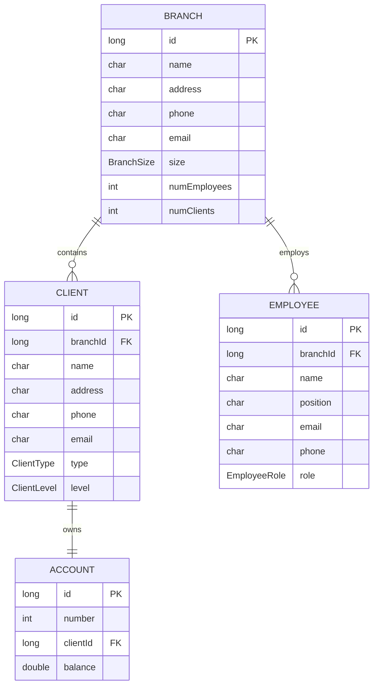

# Banking Management System - Architecture Diagram

## Application Overview
This is a C++ console-based Banking Management System that manages clients, employees, accounts, and branches with persistent file storage.

## System Architecture Diagram

```mermaid
flowchart TB
    Start([Application Start]) --> Load[Load Data from Files]
    
    Load --> LoadFiles{File I/O Module}
    LoadFiles -->|clients.dat| ClientData[(Client Data)]
    LoadFiles -->|employees.dat| EmployeeData[(Employee Data)]
    LoadFiles -->|accounts.dat| AccountData[(Account Data)]
    LoadFiles -->|branches.dat| BranchData[(Branch Data)]
    
    ClientData --> MainMenu[Main Menu]
    EmployeeData --> MainMenu
    AccountData --> MainMenu
    BranchData --> MainMenu
    
    MainMenu -->|1| ClientMenu[Client Menu]
    MainMenu -->|2| EmployeeMenu[Employee Menu]
    MainMenu -->|3| AccountMenu[Account Menu]
    MainMenu -->|4| BranchMenu[Branch Menu]
    MainMenu -->|0| Exit[Exit Application]
    
    ClientMenu --> ClientOps{Client Operations}
    ClientOps -->|Add| AddClient[Create Client & Account]
    ClientOps -->|View| ViewClient[Display All Clients]
    ClientOps -->|Edit| EditClient[Modify Client Data]
    ClientOps -->|Search| SearchClient[Find by ID/Name/Email]
    ClientOps -->|Sort| SortClient[Sort by Name/Phone/Email]
    ClientOps -->|Delete| DeleteClient[Remove Client]
    ClientOps -->|Stats| CalcClient[Calculate Statistics]
    ClientOps -->|Back| MainMenu
    
    EmployeeMenu --> EmployeeOps{Employee Operations}
    EmployeeOps -->|Add| AddEmployee[Create Employee]
    EmployeeOps -->|View| ViewEmployee[Display All Employees]
    EmployeeOps -->|Edit| EditEmployee[Modify Employee Data]
    EmployeeOps -->|Search| SearchEmployee[Find by ID/Name/Email]
    EmployeeOps -->|Sort| SortEmployee[Sort by Name/Role]
    EmployeeOps -->|Delete| DeleteEmployee[Remove Employee]
    EmployeeOps -->|Stats| CalcEmployee[Calculate Statistics]
    EmployeeOps -->|Back| MainMenu
    
    AccountMenu --> AccountOps{Account Operations}
    AccountOps -->|View| ViewAccount[Display All Accounts]
    AccountOps -->|Edit| EditAccount[Modify Account Data]
    AccountOps -->|Search| SearchAccount[Find by ID/Number/ClientID]
    AccountOps -->|Sort| SortAccount[Sort by Balance]
    AccountOps -->|Delete| DeleteAccount[Remove Account]
    AccountOps -->|Stats| CalcAccount[Calculate Statistics]
    AccountOps -->|Back| MainMenu
    
    BranchMenu --> BranchOps{Branch Operations}
    BranchOps -->|Add| AddBranch[Create Branch]
    BranchOps -->|View| ViewBranch[Display All Branches]
    BranchOps -->|Edit| EditBranch[Modify Branch Data]
    BranchOps -->|Search| SearchBranch[Find by ID/Name]
    BranchOps -->|Sort| SortBranch[Sort by Name/Clients/Size]
    BranchOps -->|Delete| DeleteBranch[Remove Branch]
    BranchOps -->|Stats| CalcBranch[Calculate Statistics]
    BranchOps -->|Back| MainMenu
    
    Exit --> Save[Save Data to Files]
    Save --> SaveFiles{File I/O Module}
    SaveFiles -->|clients.dat| SaveClient[(Save Clients)]
    SaveFiles -->|employees.dat| SaveEmployee[(Save Employees)]
    SaveFiles -->|accounts.dat| SaveAccount[(Save Accounts)]
    SaveFiles -->|branches.dat| SaveBranch[(Save Branches)]
    
    SaveClient --> Cleanup[Free Memory]
    SaveEmployee --> Cleanup
    SaveAccount --> Cleanup
    SaveBranch --> Cleanup
    
    Cleanup --> End([Application End])
    
    style Start fill:#90EE90
    style End fill:#FFB6C1
    style MainMenu fill:#87CEEB
    style ClientMenu fill:#DDA0DD
    style EmployeeMenu fill:#DDA0DD
    style AccountMenu fill:#DDA0DD
    style BranchMenu fill:#DDA0DD
```

## Data Model Relationships

## Component Architecture

```mermaid
graph TB
    subgraph "Main Application Layer"
        Main[main.cpp]
        Menu[menu.cpp/menu.h]
    end
    
    subgraph "Data Models"
        Client[Client.h]
        Employee[Employee.h]
        Account[Account.h]
        Branch[Branch.h]
    end
    
    subgraph "Business Logic Layer"
        DataView[dataView.cpp/h<br/>Display Functions]
        DataEdit[dataEdit.cpp/h<br/>Modify Functions]
        DataSearch[dataSearch.cpp/h<br/>Search Functions]
        DataSort[dataSort.cpp/h<br/>Sort Functions]
        DataCalc[dataCalc.cpp/h<br/>Statistics Functions]
        DeleteData[deleteData.cpp/h<br/>Delete Functions]
    end
    
    subgraph "Data Access Layer"
        FileIO[fileIO.cpp/h<br/>Load/Save Operations]
    end
    
    subgraph "Utility Layer"
        Validation[numberValidationHelper.h<br/>Input Validation]
    end
    
    subgraph "Persistent Storage"
        ClientsFile[(clients.dat)]
        EmployeesFile[(employees.dat)]
        AccountsFile[(accounts.dat)]
        BranchesFile[(branches.dat)]
        TransFile[(transactions.dat)]
    end
    
    Main --> Menu
    Main --> FileIO
    Menu --> DataView
    Menu --> DataEdit
    Menu --> DataSearch
    Menu --> DataSort
    Menu --> DataCalc
    Menu --> DeleteData
    Menu --> Validation
    
    DataView --> Client
    DataView --> Employee
    DataView --> Account
    DataView --> Branch
    
    DataEdit --> Client
    DataEdit --> Employee
    DataEdit --> Account
    DataEdit --> Branch
    
    DataSearch --> Client
    DataSearch --> Employee
    DataSearch --> Account
    DataSearch --> Branch
    
    DataSort --> Client
    DataSort --> Employee
    DataSort --> Account
    DataSort --> Branch
    
    DataCalc --> Client
    DataCalc --> Employee
    DataCalc --> Account
    DataCalc --> Branch
    
    DeleteData --> Client
    DeleteData --> Employee
    DeleteData --> Account
    DeleteData --> Branch
    
    FileIO --> ClientsFile
    FileIO --> EmployeesFile
    FileIO --> AccountsFile
    FileIO --> BranchesFile
    FileIO --> TransFile
```

## Application Flow

### Startup Sequence
1. **Application starts** (`main()` function executes)
2. **Load data from files** using `fileIO` module:
   - `loadClients("clients.dat", ...)`
   - `loadEmployees("employees.dat", ...)`
   - `loadAccounts("accounts.dat", ...)`
   - `loadBranches("branches.dat", ...)`
3. **Display Main Menu** and wait for user input

### Main Menu Loop
The application runs in a loop until the user chooses to exit:
- **Option 1**: Client Management → `handleClientMenu()`
- **Option 2**: Employee Management → `handleEmployeeMenu()`
- **Option 3**: Account Management → `handleAccountMenu()`
- **Option 4**: Branch Management → `handleBranchMenu()`
- **Option 0**: Exit application

### CRUD Operations Pattern
Each entity (Client, Employee, Account, Branch) supports:

1. **Create/Add**:
   - User enters data via console
   - Data validation using `numberValidationHelper`
   - New record added to dynamic array
   - For Clients: Account is automatically created

2. **Read/View**:
   - Display all records using `dataView` module
   - Search by various criteria using `dataSearch` module

3. **Update/Edit**:
   - Find record by ID
   - Modify selected fields using `dataEdit` module

4. **Delete**:
   - Find record by ID/Name/Email
   - Remove from array using `deleteData` module

5. **Additional Operations**:
   - **Sort**: Organize records by different criteria (`dataSort`)
   - **Statistics**: Calculate totals and counts (`dataCalc`)

### Shutdown Sequence
1. **User selects Exit** (Option 0 from Main Menu)
2. **Save data to files** using `fileIO` module:
   - `saveClients("clients.dat", ...)`
   - `saveEmployees("employees.dat", ...)`
   - `saveAccounts("accounts.dat", ...)`
   - `saveBranches("branches.dat", ...)`
3. **Free allocated memory** (delete dynamic arrays)
4. **Application terminates**

## Key Features

### Entity Management
- **Branches**: Bank branch locations with size classification (Small/Medium/Large)
- **Employees**: Staff members with roles (Teller/Manager/Admin) assigned to branches
- **Clients**: Individual or Company customers with levels (Regular/Premium/VIP) assigned to branches
- **Accounts**: Bank accounts with balances linked to clients

### Relationships
- Each **Client** belongs to a **Branch**
- Each **Employee** works at a **Branch**
- Each **Account** is owned by a **Client**
- **Branch** tracks its client and employee counts

### Data Persistence
- All data is stored in binary `.dat` files
- Data is loaded at startup and saved at shutdown
- Files: `clients.dat`, `employees.dat`, `accounts.dat`, `branches.dat`

### Input Validation
- Uses `numberValidationHelper.h` for validating numeric inputs
- Ensures data integrity and prevents invalid entries
- Validates ranges and required fields

## Technical Stack
- **Language**: C++
- **Storage**: Binary file I/O
- **Memory Management**: Dynamic arrays with manual allocation/deallocation
- **Architecture**: Console-based menu-driven application
- **Pattern**: Procedural programming with modular design
