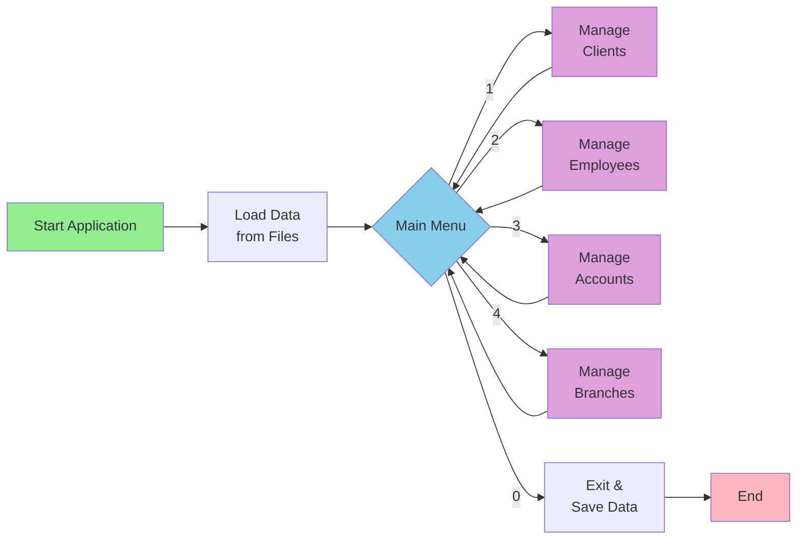

# Banking Management System

A console-based C++ application for managing banking operations including branches, employees, clients, and accounts.

## Quick Start

### Build and Run
```bash
# Compile the project using your C++ compiler
g++ -o banking_system main.cpp menu.cpp dataView.cpp dataEdit.cpp dataSearch.cpp dataSort.cpp dataCalc.cpp deleteData.cpp fileIO.cpp

# Run the application
./banking_system
```

## How It Works - Simplified Diagram



## Features

### 🏦 Branch Management
- Add, view, edit, search, sort, and delete branches
- Branch sizes: Small, Medium, Large
- Track employee and client counts per branch

### 👥 Client Management
- Add clients (Individual or Company)
- Client levels: Regular, Premium, VIP
- Automatically create account when adding client
- Search by ID, Name, or Email
- Sort by Name, Phone, or Email
- View statistics by client level

### 💼 Employee Management
- Add, view, edit, search, sort, and delete employees
- Employee roles: Teller, Manager, Admin
- Assign employees to branches
- Search by ID, Name, or Email
- Sort by Name or Role

### 💰 Account Management
- View, edit, search, sort, and delete accounts
- Each account linked to a client
- Search by ID, Account Number, or Client ID
- Sort by Balance
- Track account balances

## Data Model

The system manages four main entities with the following relationships:

- **Branch** ← **Employee** (one-to-many)
- **Branch** ← **Client** (one-to-many)
- **Client** ← **Account** (one-to-one)

## Data Storage

All data is persisted in binary files:
- `clients.dat` - Client information
- `employees.dat` - Employee records
- `accounts.dat` - Account details
- `branches.dat` - Branch information
- `transactions.dat` - Transaction history (placeholder)

## Detailed Documentation

For a comprehensive understanding of the application architecture, data flow, and component interactions, see:
- **[ARCHITECTURE.md](ARCHITECTURE.md)** - Complete system architecture with detailed diagrams

## Project Structure

```
Course_Project/
├── main.cpp                    # Application entry point
├── menu.cpp/h                  # Menu system and handlers
├── Client.h                    # Client data structure
├── Employee.h                  # Employee data structure
├── Account.h                   # Account data structure
├── Branch.h                    # Branch data structure
├── dataView.cpp/h             # Display functions
├── dataEdit.cpp/h             # Edit functions
├── dataSearch.cpp/h           # Search functions
├── dataSort.cpp/h             # Sort functions
├── dataCalc.cpp/h             # Statistics functions
├── deleteData.cpp/h           # Delete functions
├── fileIO.cpp/h               # File I/O operations
├── numberValidationHelper.h    # Input validation
└── *.dat                       # Binary data files
```

## Technologies Used

- **Language**: C++
- **Storage**: Binary file I/O
- **Architecture**: Modular procedural design
- **Interface**: Console-based menu system

## License

This is a course project for educational purposes.
